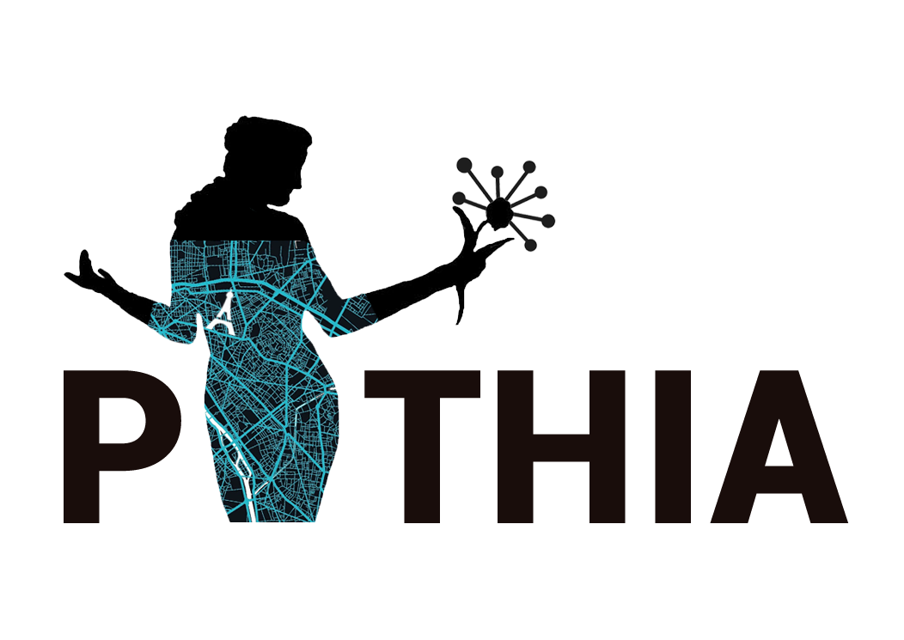
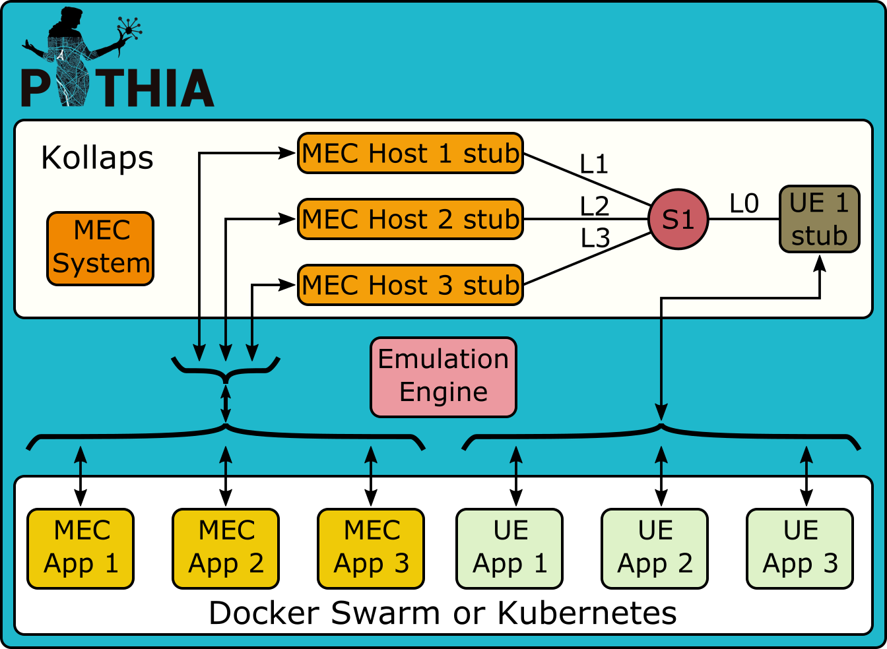
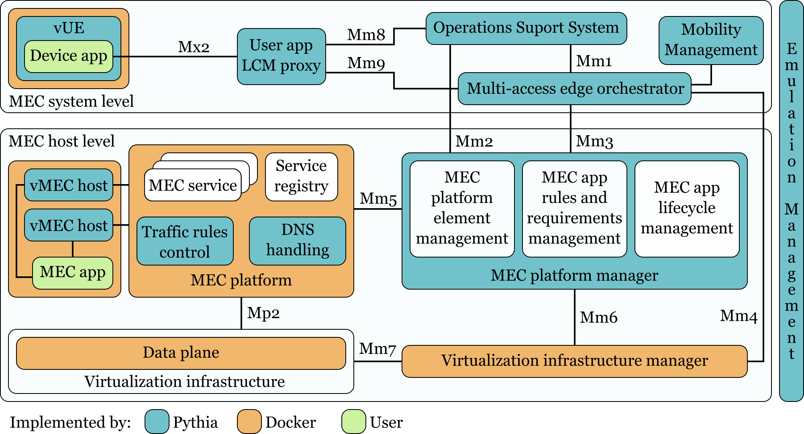

  

Pythia is an initiative to study the effects of the User Equipement (UE) mobility to the Multi-Access Edge Computing (MEC)  services. 

# Requirements
When a UE moves, the delay, throughput, and jitter between the UE and the different MEC hosts change. The main goal of Pythia is to emulate UE mobility while MEC hosts remain static. Therefore, Pythia should receive a mobility trace of one or several UEs and emulate the changes in the network between the UEs and the MEC hosts. The objective is to create a platform in which it is possible to learn more about the UE and MEC applications when mobility takes place. Fig. 1. represents the functionality of Pythia. Pythia receives as inputs the applications that should run in the UEs, in the MEC hosts, and in the Cloud. Additionally, Pythia also receives the mobility traces of each UE. With these inputs, Pythia emulates the network as applications experience it.

  <figure>
    
    <figcaption>Fig. 1. The high-level objective of Pythia.</figcaption>
  </figure>

# Tasks

To implement the emulation, Pythia should accomplish the following tasks:

1. Read the traces and extract the network graph;
2. Instantiate the UEs and the MEC hosts;
3. Start the applications in the UEs and MEC hosts while emulating the network;
4. End the emulation and consolidate the results.

# Emulation
After Pythia has constructed the time-verying graph, it is important to set-up each node that work as UEs or MEC hosts in the emulation. Each node in the time-varying graph generates a node, that is different if the node represents a UE or a MEC host. These nodes act as real-world applications, with Pythia emulating the network between them.

## Architectural elements
Pythia achieves the emulation through a relationship between different elements. As depicted in Fig 2., Pythia harvests the computing power of one or more **emulation hosts**. They can be baremetal or virtual machines, as long os they support nested virtualization. 

  <figure>
    
    <figcaption>Fig. 2. The architecture of Pythia.</figcaption>
  </figure>

### Pythia topology extractors
This architectural element encapsulates all the software to read a mobility trace and end up with a dynamic topology. The topology is achieved by comparing users geographic coordinates with cellphone tower coordinates.

### Pythia emulation runtime
This element manages the lifecycle of the emulation. It instantiates the applications, the MEC host policy manager, and manages the network topology.

### Container orchestration infrastructure
This element manages the lifecycle of the containers running the applications.

### MEC host policy manager
This element enforces the user-defined MEC host policy.

The implementation of the elements employs the tools on Tab. 1. The elements are meant to be loosely coupled to ease the reuse. For instance, it should be simple to reuse Pythia with another hosting infrastructure or another virtualization engine.

  <table>
    <tr>
      <th>Element</th>
      <th>Implementation</th>
    </tr>
    <tr>
      <td>Container-based virtualization engine</td>
      <td><a href="https://www.docker.com/">Docker</a></td>
    </tr>
      <td>UE container</td>
      <td><a href="https://github.com/budtmo/docker-android">Docker-android</a></td>
    </tr>
    <tr>
      <td>UE Application</td>
      <td>Pythia UE Application Example</td>
    </tr>
    <tr>
      <td>MEC container</td>
      <td>Application-specific Docker image</td>
    </tr>
    </tr>
      <td>MEC Application</td>
      <td>Pythia MEC Application Example</td>
    </tr>
    <tr>
      <td>Cloud container</td>
      <td>Yet to be defined</td>
    </tr>
    </tr>
      <td>Cloud Application</td>
      <td>Pythia cloud Application Example</td>
    </tr>
    <tr>
      <td>Pythia emulation engine</td>
      <td>Python</td>
    </tr>
    <caption>Tab. 1. The implementation of the UE emulation elements.</caption>
  </table>

## The network graph
Internally, Pythia should represent the network as a time-varying graph. The vertices of the graph are the UE and the MEC hosts, while the edges are the connections between them. An edge can have many attributes associated to it, such as delay or bandwidth.

# ETSI compatibility

The European Telecommunications Standards Institute (ETSI) has produced a standard for MEC. The ETSI architecture is depicted in Fig. 3. 

  <figure>
    
    <figcaption>Fig. 3. The ETSI architecture.</figcaption>
  </figure>

As many ETSI-compliant initiatives ([OpenNESS](https://www.openness.org), [LightEdge](https://www.estefaniacoronado.com/publication/commag-lightedge/), and[LightMEC](https://ieeexplore.ieee.org/document/8584926)), Pythia uses [Kubernetes](https://kubernetes.io) as the main piece to bind together its architectural elements. Therefore, we have Kubernetes playing the roles of MEC platform manager and MEC platform, providing the services of element management, application rules an requirements management, lifecycle management, traffic rules control, and service registry. The virtualization infrastruture management is shared between Kubernetes and [Docker](https://www.docker.com).

  <figure>
    
    <figcaption>Fig. 4. Pythia's implementation of the ETSI architecture .</figcaption>
  </figure>

# Tools
Pythia uses a number of tools to work. They are:
- Kollaps
- Bind9
- Docker

# Progress
The development is divided into tasks. It is possible that we still break into smaller pieces the tasks that are not accomplished.

- [x] Develop Pythia UE Application Example.
- [x] Develop Pythia MEC Application Example.
- [x] Run the UE and the MEC applications locally.
- [x] Install docker to Grid5k.
- [x] Instantiate a container in Grid5k and install Pythia MEC Application on it.
- [x] Instantiate a UE in Grid5k and install Pythia UE Application on it.
- [x] Read from mobility traces the UEs to instantiate (no CDR).
- [x] Instantiate the UEs based on mobility traces.
- [x] Instantiate MEC hosts from a configuration file.
- [x] Read eNB-MEC links from configuration files
- [ ] Estimate UE-MEC links from mobility traces.
- [ ] Estimate links throughtout time (Kollaps).
- [ ] Create mobility events.
- [ ] Start mobility emulation (Kollaps).
- [ ] Create mobility emulation results.
- [ ] Think about Pythia's scalability.

# Problems and questions

1. Users write the applications (both MEC and UE applications). The mobility traces define the network exchanges between them. How to synchronise the network conditions with the applications requests? One option is that traces define the network conditions. We inform the applications of the start and the end of the emulation. In this case, the data exchange in the traces is not considered.

2. Should we work with a single emulation host (not to be confused with MEC host) or should we work with several hosts? In the later case, how to cope with network limitations between the emulation hosts?

3. I am making the MEC and the UE node independent. This means that similar structures (for instance, the interface with grid5000) will not be shared among them. Maybe there should be a "shared" code.

4. Scalability is an issue. To this moment, all the emulations run in a single machine. We can use Kubernetes to integrate several machines. Nevertheless, the links between them are subjected to the same network conditions that Pythia emulates, hindering the emulation. This means that we need three efforts. The first is to identify the network conditions between the nodes. The second is to allocate the hardware infrastructure that will emulate each device. This is important because if two mchines in the infrastructure have a delay _d_ between them, then they can only emulate devices that communicate with delay greater or equal to _d_. The third and last effort is to compensate the real network conditions from the emulated network conditions.

5. Application-emulation synchronisation. Every application should run a NTP client as well as Kollaps and Docker host, that should point to the same NTP server. Pythia must "start everyone together".

# Similar tools
This section describes similar tools so we can understand better what is Pythia's role and contribution.

## Kollaps
[Kollaps](https://arxiv.org/pdf/2004.02253.pdf) emulates a dynamic network connecting applications. Developers integrated Kollaps with Docker Swarm and Kubernetes, to make the application deployment as easy as possible. It works creating a topology from an input file, and simplifying it. Kollaps uses another input file to model changes the topology of the network that should happen during the emulation.

Integration proposal (not definitive):
- Add a module to transform mobility traces into Kollaps input files
- Integrate Kollaps and some MEC platform (?)

# VNF mobility vs MEC mobility
MEC can be regarded as a Virtual Network Function (VNF). Nevertheless, the coupling between MEC services and UE applications is somehow more tight than the coupling expected between traditional VNFs and the same UE applications. While traditional VNFs are expected to be transparent to the users, MEC applications are expected to interact and answer requests from UE applications. For this reason, we expect that the mobility of MEC applications gets more attention than that of the VNFs.

In [this paper](https://gitlab.inria.fr/pcruzcam/pythia/-/blob/master/doc/mobility/08486021.pdf), authors discuss the mobility of VNFs. They have an almost artistic sentence that states: "while placing vNFs near end-users radically reduces vNF-to-user end-to-end (E2E) latency (the latency experienced between an end-user and the associated vNF), time-to-response, and unnecessary utilisation of the core network, the location of edge vNFs has to be carefully managed to accommodate movements of end-users (that are expected to happen constantly due to the small cell sizes of next generation mobile architecture (5G)) and also to keep up with varying traffic dynamics that cause highly variable latency across network links.". A very condensed explanation.

